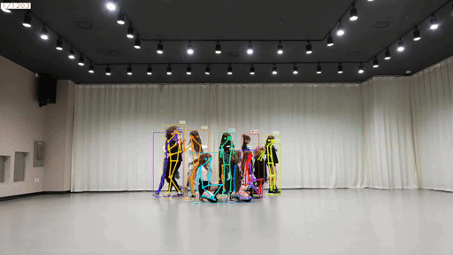
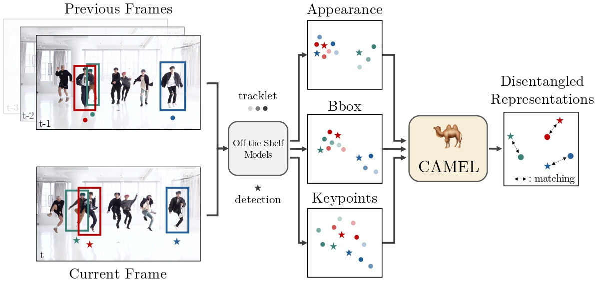
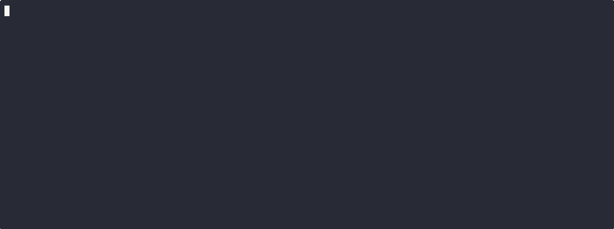
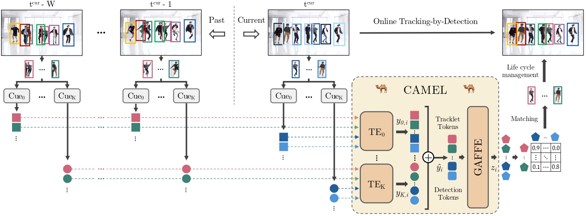

<div align="center">

# 🐫 CAMELTrack 🐫
## Context-Aware Multi-cue ExpLoitation for Online Multi-Object Tracking

[](https://arxiv.org/abs/2505.01257) 
[]()
[]()
[]()
<!---
Add PoseTrack21 & BEE24
--->

<p align="center">
  
  
  
  
</p>

</div>

>**[CAMELTrack: Context-Aware Multi-cue ExpLoitation for Online Multi-Object Tracking](https://arxiv.org/abs/2505.01257)**
>
>Vladimir Somers, Baptiste Standaert, Victor Joos, Alexandre Alahi, Christophe De Vleeschouwer
>
>[*arxiv 2505.01257*](https://arxiv.org/abs/2505.01257)

**CAMELTrack** is an **Online Multi-Object Tracker** that learns to associate detections without hand-crafted heuristics. 
It combines multiple cues through a lightweight, fully trainable module and achieves state-of-the-art performance while 
staying modular and fast.

https://github.com/user-attachments/assets/706a6b5a-10f5-4464-97bd-266e737ffcc3

## 📄 Abstract
**Online Multi-Object Tracking** has been recently dominated by **Tracking-by-Detection** (TbD) methods, where recent advances 
rely on increasingly sophisticated heuristics for tracklet representation, feature fusion, and multi-stage matching. 
The key strength of TbD lies in its modular design, enabling the integration of specialized off-the-shelf models like 
motion predictors and re-identification. However, the extensive usage of human-crafted rules for temporal associations 
makes these methods inherently limited in their ability to capture the complex interplay between various tracking cues. 
In this work, we introduce **CAMEL**, a novel association module for Context-Aware Multi-Cue ExpLoitation, that learns 
resilient association strategies directly from data, breaking free from hand-crafted heuristics while maintaining TbD's 
valuable modularity.

<p align="center">
  
</p>

At its core, CAMEL employs two transformer-based modules and relies on a novel **Association-Centric 
Training** scheme to effectively model the complex interactions between tracked targets and their various association cues. 
Unlike End-to-End Detection-by-Tracking approaches, our method remains lightweight and fast to train while being able 
to leverage external off-the-shelf models. Our proposed online tracking pipeline, CAMELTrack, achieves state-of-the-art 
performance on multiple tracking benchmarks.

## 🚀 Upcoming

- [x] Cleaning of the code
- [x] Simplified installation and integration into TrackLab
- [x] Public release of the repository
- [x] Release of the SOTA weights
- [x] Release of the paper on ArXiv
- [x] Release of the `tracker_states` used for the training
- [ ] Release of the `tracker_states` and `detections` used for the evaluation
- [ ] Cleaning of the code for the training

## ⚙️ Quick Installation Guide
CAMELTrack is built on top of [TrackLab](https://github.com/TrackingLaboratory/tracklab), a research framework for Multi-Object Tracking.


### Clone the repository & Install

First git clone this repository : 

```bash
git clone https://github.com/TrackingLaboratory/CAMELTrack.git
```

You can then choose to install using either [uv](https://docs.astral.sh/uv/getting-started/installation/)
or directly using pip (while managing your environment yourself).

#### [Recommended] Install using uv
1. Install uv : https://docs.astral.sh/uv/getting-started/installation/
2. Create a new virtual environment with a recent python version (>3.9) : 
```bash
cd cameltrack
uv venv --python 3.12
```

> [!NOTE]
> To use the virtual environment created by uv,
> you need to prefix all commands with `uv run`, as shown in the examples below.
> Using `uv run` will automatically download the dependencies the first time it is run. 

#### Install using pip
1. Move into the directory
```bash
cd cameltrack
```
2. Create a virtual environment (using, for example: conda)
3. Install the dependencies inside the virtual environment :
```bash
pip install -e .
```

> [!NOTE]
> The following instructions use the uv installation, but you can just remove `uv run`
> from all commands.

### First run

In order to showcase CAMELTrack, we provide a default video, that will
be visualized automatically when running for the first time:
```bash
uv run tracklab -cn cameltrack
```

### Updating
Please make sure to check the official GitHub regularly for updates.
To update this repository to its latest version, run `git pull` on the repository.


### Data preparation

Download [MOT17](https://motchallenge.net/), [MOT20](https://motchallenge.net/), 
[DanceTrack](https://drive.google.com/drive/folders/1ASZCFpPEfSOJRktR8qQ_ZoT9nZR0hOea), 
[BEE24](https://holmescao.github.io/datasets/BEE24), [PoseTrack21](https://github.com/anDoer/PoseTrack21) and put them under data/ inside the cameltrack directory.

### Off-the-shelf Model weights and outputs
The model weights for the detectors, reID models, and pose estimation models that have been used
for the paper are available from DiffMOT : https://github.com/Kroery/DiffMOT/releases. 

The off-the-shelf model outputs for the different datasets ("Tracker States") are 
available in Pickle format [on huggingface](https://huggingface.co/trackinglaboratory/CAMELTrack/tree/main/states)
(if you don't want to run the off-the-shelf models).

You can already use the ultralytics yolov8 or yolov11 detector or pose estimator, and
the reID weights are downloaded automatically [from huggingface](https://huggingface.co/trackinglaboratory/keypoint_promptable_reid).

Alternatively, you can use the detections from [DiffMOT](https://github.com/Kroery/DiffMOT) directly, by placing them in the appropriate directories.

### 🏋️‍♀ CAMELTrack Model Weights
The pre-trained weights used to achieve state-of-the-art results in the paper are listed below. They are automatically downloaded when running CAMELTrack with the default configuration.

| Dataset     |     Appearance     |      Keypoints      |  HOTA  | Weights                                                                                                                                                                                                                                                                                                                              |
|:------------|:------------------:|:-------------------:|:------:|:-------------------------------------------------------------------------------------------------------------------------------------------------------------------------------------------------------------------------------------------------------------------------------------------------------------------------------------|
| DanceTrack  | :white_check_mark: |                     |  66.1  | [camel_bbox_app_dancetrack.ckpt](https://huggingface.co/trackinglaboratory/CAMELTrack/blob/main/camel_bbox_app_dancetrack.ckpt)                                                                                                                                                                                                      |
| DanceTrack  | :white_check_mark: | :white_check_mark:  |  69.3  | [camel_bbox_app_kps_dancetrack.ckpt](https://huggingface.co/trackinglaboratory/CAMELTrack/blob/main/camel_bbox_app_kps_dancetrack.ckpt)                                                                                                                                                                                              |
| SportsMOT   | :white_check_mark: | :white_check_mark:  |  80.3  | [camel_bbox_app_kps_sportsmot.ckpt](https://huggingface.co/trackinglaboratory/CAMELTrack/blob/main/camel_bbox_app_kps_sportsmot.ckpt)                                                                                                                                                                                                |
| MOT17       | :white_check_mark: | :white_check_mark:  |  62.4  | [camel_bbox_app_kps_mot17.ckpt](https://huggingface.co/trackinglaboratory/CAMELTrack/blob/main/camel_bbox_app_kps_mot17.ckpt)                                                                                                                                                                                                    |
| PoseTrack21 | :white_check_mark: | :white_check_mark:  |  66.0  | [camel_bbox_app_kps_posetrack24.ckpt](https://huggingface.co/trackinglaboratory/CAMELTrack/blob/main/camel_bbox_app_kps_posetrack24.ckpt)                                                                                                                                                                                                                                                                                              |
| BEE24       |                    |                     |  50.3  | [camel_bbox_bee24.ckpt](https://huggingface.co/trackinglaboratory/CAMELTrack/blob/main/camel_bbox_bee24.ckpt)                                                                                                                                                                                                                                                                                                            |


## 🎯 Tracking

Run the following command to track, for example, on DanceTrack, with the checkpoint obtained from training, or the provided
model weights (pretrained weights are downloaded automatically when using the name from the table above) :

```
uv run tracklab -cn cameltrack dataset=dancetrack dataset.eval_set=test modules.track.checkpoint_path=camel_bbox_app_kps_dancetrack.ckpt
```

By default this will create a new directory inside `outputs/cameltrack` which will contain a visualization of the
output for each sequence, in addition to the tracking output in MOT format.

## 💪 Training

### Training on a default dataset

You first have to run the complete tracking pipeline (without tracking, with a pre-trained
CAMELTrack or with a SORT-based tracker, like oc-sort), on train, validation (and testing) sets
for the dataset you want to train, and save the "Tracker States":
```bash
uv run tracklab -cn cameltrack dataset=dancetrack dataset.eval_set=train
uv run tracklab -cn cameltrack dataset=dancetrack dataset.eval_set=val
uv run tracklab -cn cameltrack dataset=dancetrack dataset.eval_set=test
```
By default they are saved in the `states/` directory.

You can also use the Tracker States we provide for the
common MOT datasets [on huggingface](https://huggingface.co/trackinglaboratory/CAMELTrack/tree/main/states).

Once you have the Tracker States, you can put them in the dataset directory
(in `data_dir`, by default `./data/$DATASET`) under the `states/` directory, with the following names :
```text
data/
    DanceTrack/
        train/
        val/
        test/
        states/
            train.pklz
            val.pklz
            test.pklz
```

Once you have the Tracker States, run the following command to train on a specific dataset
(by default, DanceTrack) : 
```
uv run tracklab -cn cameltrack_train dataset=dancetrack
```


> [!NOTE]
> You can always modify the configuration in [cameltrack.yaml](cameltrack/configs/cameltrack.yaml), and in the
> other files inside this directory, instead of passing these values in the command line.
> 
> For example, to change the dataset for training, you can modify [camel.yaml](cameltrack/configs/modules/track/camel.yaml).

By default this will create a new directory inside `outputs/cameltrack_train`, which will contain the checkpoints
to the created models, which can then be used for tracking and evaluation, by setting
the `modules.track.checkpoint_path` configuration key in [camel.yaml](cameltrack/configs/modules/track/camel.yaml#L4).

### Training on a custom dataset
To train on a custom dataset, you'll have to integrate it in tracklab, either by using the MOT format, or by implementing
a new dataset class. Once that's done, you can modify [cameltrack.yaml](cameltrack/configs/cameltrack.yaml), to point to
the new dataset.


### Full CAMELTrack pipeline
Here is an overview of the full online pipeline of CAMELTrack, following the tracking-by-detection paradigm.

<p align="center">
  
</p>


## 🖋 Citation

If you use this repository for your research or wish to refer to our contributions, please use the following BibTeX entries:

[CAMELTrack]():
```
@misc{somers2025cameltrackcontextawaremulticueexploitation,
      title={CAMELTrack: Context-Aware Multi-cue ExpLoitation for Online Multi-Object Tracking}, 
      author={Vladimir Somers and Baptiste Standaert and Victor Joos and Alexandre Alahi and Christophe De Vleeschouwer},
      year={2025},
      eprint={2505.01257},
      archivePrefix={arXiv},
      primaryClass={cs.CV},
      url={https://arxiv.org/abs/2505.01257}, 
}
```

[TrackLab](https://github.com/TrackingLaboratory/tracklab):
```
@misc{Joos2024Tracklab,
	title = {{TrackLab}},
	author = {Joos, Victor and Somers, Vladimir and Standaert, Baptiste},
	journal = {GitHub repository},
	year = {2024},
	howpublished = {\url{https://github.com/TrackingLaboratory/tracklab}}
}
```
